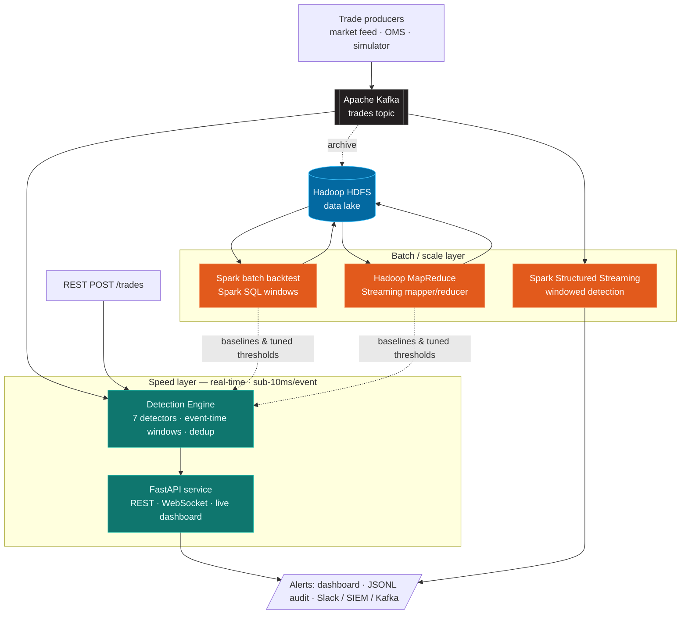

# TradeWatch — Real-Time Trade Anomaly Detection Engine

<p align="center">
  <b>A big-data trade-surveillance stack: Apache Kafka → FastAPI for sub-10ms real-time anomaly alerts, with an Apache Spark, PySpark & Hadoop (HDFS + MapReduce) scale layer for distributed detection and backtesting over a data lake.</b>
</p>

<p align="center">
  
  
  
  
  
  
  
  
</p>

---

## Why this exists

Exchanges, brokers, prop desks and crypto venues are legally required to
surveil their own order flow for **market abuse** (spoofing, layering, wash
trading, momentum ignition) and to catch **fat-finger / bad-data** events
before they cause losses. Off-the-shelf surveillance suites are expensive,
opaque black boxes.

**TradeWatch** is a compact, transparent surveillance stack built around a
**Lambda-style big-data architecture**:

- a **speed layer** — an **Apache Kafka → FastAPI** pipeline whose engine scores
  every trade against statistical, behavioural and ML detectors and emits
  **structured, explainable alerts** in **sub-10ms**;
- a **batch/scale layer** — **Apache Spark / PySpark** jobs and a **Hadoop
  MapReduce** job that run the same detection logic over a **Hadoop HDFS data
  lake** (backtesting, threshold tuning, baseline bootstrapping) and as
  distributed **Structured Streaming** over Kafka.

The detection core is embeddable too — drop it in any Python process.

> On a labelled 15k-trade benchmark it catches **96%+ of injected manipulation
> episodes at a <1% false-alarm rate** (see [Detection quality](#detection-quality)),
> deciding each trade with a **p99 latency of ~0.3ms** (see [Performance](#performance)).

---

## Highlights

- ⚡ **Real-time streaming core** — synchronous, allocation-light hot path; event-time windows, not wall-clock; **p99 ≈ 0.3ms/event**.
- 🧠 **7 complementary detectors** — statistical, behavioural *and* an online Isolation Forest for multivariate outliers.
- 🔎 **Explainable alerts** — every alert carries a severity, a normalized score, a human-readable reason and the supporting numbers.
- 🔕 **Alert deduplication** — per-(symbol, detector) cooldown collapses a noisy episode into one actionable alert (à la PagerDuty grouping).
- 🟥 **Apache Kafka ingestion** — consume the production trade tape from a Kafka topic; a bundled producer + broker make it one command to demo end-to-end.
- 🔶 **Apache Spark / PySpark scale layer** — the same rules as Spark SQL window functions: a **batch backtest** over historical Parquet and a **Structured Streaming** Kafka job.
- 🔵 **Hadoop big-data layer** — **HDFS** as the data lake and a **MapReduce** (Streaming) job for massive batch anomaly scans; the mapper/reducer are CI-tested via the same pipe Hadoop runs.
- 🔌 **Integrate anywhere** — REST (`POST /trades`), WebSocket stream, embedded Python API, or a Kafka consumer.
- 📊 **Live dashboard** — zero-dependency WebSocket UI, served by the app itself.
- 🧪 **Measured, not hand-wavy** — a labelled simulator + `tradewatch evaluate` / `tradewatch bench` give you precision/recall/F1 and latency as CI gates.
- 🐳 **Ship it** — Dockerfile, docker-compose (with a Kafka profile), GitHub Actions CI, tunable YAML ruleset, 12-factor config.

---

## Architecture

A **Lambda-style** split: a low-latency speed layer for real-time alerting, and
a Spark scale layer for heavy historical/distributed processing. Both apply the
same detection rules.



**Pluggable by design.** A `TradeSource` produces trades; the `DetectionEngine`
turns each trade into zero-or-more `Alert` objects; an `AlertSink` delivers them.
Swap any layer — Kafka, simulator, REST; console, JSONL, WebSocket, your own —
without touching the others.

The **7 detectors** inside the engine: price z-score, price spike, volume spike,
trade velocity, spoofing/imbalance, wash/self-trade, and an online Isolation
Forest (see [Detectors](#detectors)).

### Tech stack

| Layer | Technology | Role |
|---|---|---|
| Ingestion | **Apache Kafka** (`aiokafka`) | Consume the production trade tape; decouple producers from detection |
| Real-time engine | **Python 3.10+**, **scikit-learn** | Event-time windows + 7 detectors incl. online Isolation Forest |
| Service / API | **FastAPI**, **Uvicorn**, WebSocket | REST decisioning, live streams, dashboard |
| Distributed compute | **Apache Spark**, **PySpark** | Structured Streaming + historical backtesting with Spark SQL |
| Data lake + batch | **Apache Hadoop** (HDFS + MapReduce) | Durable storage & massive batch anomaly scans (Streaming job) |
| Config / validation | **Pydantic v2**, YAML | Typed models, 12-factor settings, tunable rules |
| Delivery | **Docker**, **docker-compose**, **GitHub Actions** | Containerised stacks + CI quality gates |

---

## Quickstart

```bash
# 1. install (Python 3.10+)
pip install -e ".[dev]"

# 2. run the service + live dashboard, with the built-in market simulator
tradewatch serve
#   → open http://localhost:8000
```

Or with Docker:

```bash
docker compose up --build   # → http://localhost:8000
```

Stream to your terminal instead:

```bash
tradewatch simulate --tps 30 --anomaly-rate 0.02
```

Prove it works with hard numbers:

```bash
tradewatch evaluate --trades 15000   # precision / recall / F1
tradewatch bench                     # per-event latency
```

### Run the full Kafka → FastAPI pipeline

One command spins up a Kafka broker, a producer publishing the simulated tape,
and TradeWatch consuming that topic:

```bash
docker compose --profile kafka up --build
#   broker + producer + consumer → http://localhost:8000
```

To point the service at your **own** Kafka without Docker:

```bash
pip install -e ".[kafka]"
TRADEWATCH_SOURCE=kafka \
TRADEWATCH_KAFKA_BOOTSTRAP_SERVERS=broker:9092 \
TRADEWATCH_KAFKA_TOPIC=trades \
  tradewatch serve
```

### Run the Apache Spark / PySpark scale layer

```bash
pip install -e ".[spark]"

# 1. generate a historical dataset (Parquet)
python examples/generate_history.py --out data/trades.parquet --trades 100000

# 2. batch-backtest the detectors across the whole history
python spark/batch_backtest.py --input data/trades.parquet --output data/anomalies.parquet

# 3. distributed Structured Streaming over Kafka
spark-submit --packages org.apache.spark:spark-sql-kafka-0-10_2.12:3.5.1 \
  spark/streaming_job.py --bootstrap localhost:9092 --topic trades
```

The batch job prints a per-detector breakdown and writes flagged anomalies to
Parquet; see [`spark/`](spark/).

### Run the Hadoop (HDFS + MapReduce) big-data layer

The MapReduce job runs the same statistical detection as a Hadoop Streaming
mapper/reducer. `mapper | sort | reducer` is exactly what the cluster executes,
so you can run it locally with no Hadoop install:

```bash
python examples/generate_history.py --out data/trades.jsonl --format json --trades 100000
hadoop/run_local.sh data/trades.jsonl          # → symbol, detector, price, qty, score
```

On a real cluster it reads and writes the **HDFS data lake** (bring one up with
`docker compose --profile hadoop up`, NameNode UI at http://localhost:9870):

```bash
hdfs dfs -put data/trades.jsonl /tradewatch/trades/
hadoop/run_streaming.sh /tradewatch/trades /tradewatch/anomalies
```

Spark reads the same HDFS paths (`hdfs://namenode:9000/...`). See [`hadoop/`](hadoop/).

---

## Detectors

| Detector | Class of abuse / issue it targets | Core idea |
|---|---|---|
| **Z-score (price)** | Off-market prints, bad ticks | Price is > N σ from the rolling per-symbol mean |
| **Price spike** | Gaps, momentum ignition, fat fingers | Large instantaneous tick-to-tick % move |
| **Volume spike** | Block trades, fat-finger sizes | Size is a large multiple of the rolling **median** (robust) |
| **Velocity** | Quote stuffing, algo runaways | Trade count per symbol in a short window exceeds a cap |
| **Spoofing / imbalance** | Spoofing, layering | Heavily one-sided burst of prints in a few seconds |
| **Wash trade / self-trade** | Wash trading, painting the tape | Same beneficial owner on both sides (self-cross), matched price & size |
| **Isolation Forest** | Novel / multivariate anomalies | Online-trained model scores the *joint* feature vector |

Each detector is independently unit-tested and reads shared per-symbol window
state, so adding your own is a ~30-line file implementing one method.

---

## Detection quality

`tradewatch evaluate` streams labelled data (normal flow + injected abuse
episodes) through the engine and scores detections with **event-based** metrics —
the standard for surveillance systems: *did we catch the episode, and how noisy
were we on normal flow?*

```
============================================================
  TradeWatch — Detection Evaluation (event-based)
============================================================
  trades evaluated     : 15,000
  anomaly events       : 258
  events detected      : 248
  false-alarm episodes : 120
------------------------------------------------------------
  precision            : 0.674
  recall               : 0.961
  F1 score             : 0.792
  false-positive rate  : 0.997%  (of normal trades)
------------------------------------------------------------
  event recall by injected pattern:
    price_spike        65/65    (100.0%)
    spoofing           48/52    ( 92.3%)
    velocity_burst     39/41    ( 95.1%)
    volume_spike       40/41    ( 97.6%)
    wash_trade         56/59    ( 94.9%)
============================================================
```

The CI pipeline runs this evaluation on every push as a **quality gate**, so a
change that quietly wrecks detection fails the build.

---

## Performance

Per-event flagging latency, measured with `tradewatch bench` (single core, event
sourced from the simulator; your mileage varies with hardware):

| Configuration | p50 | p95 | p99 | Throughput |
|---|---|---|---|---|
| **Rule core** (statistical + behavioural detectors) | ~166 µs | ~221 µs | **~294 µs** | ~5,800 events/s |
| **Full engine** (+ online Isolation Forest scoring) | ~6.4 ms | ~7.9 ms | **~9.5 ms** | ~140 events/s |

Both configurations decide each trade **well inside a 200 ms budget** — the rule
core with ~600× headroom. The Isolation Forest adds the bulk of the latency
(per-event tree traversal + periodic refits); disable it in the ruleset when you
need maximum throughput, or run it in the Spark scale layer instead.

```bash
tradewatch bench          # prints the table above for your machine
```

---

## Integration

### REST — real-time decisioning
`POST /trades` ingests a trade and returns the anomaly decision synchronously —
the entry point for pre-trade checks or a risk gateway:

```bash
curl -s localhost:8000/trades -H 'content-type: application/json' -d '{
  "symbol": "AAPL", "price": 999.0, "quantity": 100, "side": "buy"
}' | jq
```

```json
{
  "trade_id": "trd_9f2c...",
  "anomalous": true,
  "alerts": [
    { "detector": "zscore", "severity": "critical", "score": 1.0,
      "reason": "price 999.0000 is +42.10σ from mean 194.9812 (σ=0.19)" }
  ]
}
```

### WebSocket — live alert stream
```
ws://localhost:8000/ws/alerts     # every alert as it fires
ws://localhost:8000/ws/trades     # the raw trade tape
```

### Embedded — no server
```python
from tradewatch import DetectionEngine, Trade

engine = DetectionEngine()
for alert in engine.process(Trade(symbol="BTC-USD", price=61990, quantity=0.5)):
    print(alert.severity, alert.reason)
```

### Kafka — production event backbone
```python
from tradewatch import DetectionEngine, Pipeline
from tradewatch.sources.kafka_source import KafkaTradeSource
from tradewatch.sinks import JsonlFileSink

pipeline = Pipeline(
    source=KafkaTradeSource(topic="trades", bootstrap_servers="broker:9092"),
    engine=DetectionEngine(),
    sinks=[JsonlFileSink("alerts.jsonl")],
)
# await pipeline.run()
```

See [`examples/`](examples/) for runnable scripts.

### HTTP endpoints

| Method | Path | Purpose |
|---|---|---|
| `GET` | `/` | Live dashboard |
| `GET` | `/health` | Liveness / readiness |
| `GET` | `/stats` | Engine + pipeline metrics |
| `GET` | `/config` | Effective detection ruleset |
| `GET` | `/alerts?limit=N` | Recent alerts (ring buffer) |
| `POST` | `/trades` | Ingest one trade → alerts |
| `WS` | `/ws/alerts` | Live alert stream |
| `WS` | `/ws/trades` | Live trade tape |

---

## Configuration

**Detection thresholds** live in [`config/detection_rules.yaml`](config/detection_rules.yaml) —
tune sensitivity without touching code:

```yaml
zscore:
  price_threshold: 3.0
price_spike:
  pct_threshold: 0.03
alert_cooldown_seconds: 8.0   # dedup window per (symbol, detector)
```

**Service settings** come from `TRADEWATCH_*` env vars (see [`.env.example`](.env.example)):

```bash
TRADEWATCH_PORT=8000
TRADEWATCH_SIMULATOR_ENABLED=false     # turn off the demo feed in production
TRADEWATCH_SIMULATOR_TRADES_PER_SECOND=25
```

---

## Trade schema

```jsonc
{
  "symbol": "AAPL",          // required
  "price": 194.32,           // required, > 0
  "quantity": 100,           // required, > 0
  "side": "buy",             // buy | sell
  "account_id": "acct_007",  // enables wash-trade detection
  "counterparty_id": "acct_007",
  "venue": "XNAS",
  "currency": "USD",
  "timestamp": "2026-01-01T15:00:00Z"  // event-time; defaults to now
}
```

---

## Development

```bash
make dev       # install with dev + kafka + spark extras
make test      # pytest (39 tests)
make lint      # ruff
make evaluate  # precision/recall report
make run       # serve the dashboard
```

Project layout:

```
src/tradewatch/
├── models.py        # Trade / Alert / Severity
├── config.py        # YAML ruleset + env settings (simulator + Kafka)
├── windows.py       # per-symbol event-time rolling stats
├── detectors/       # one file per detector (7 detectors)
├── engine.py        # orchestration + alert dedup
├── pipeline.py      # source → engine → sinks
├── sources/         # simulator, kafka, base
├── sinks/           # console, file (JSONL), websocket/broadcaster
├── api/             # FastAPI app + dashboard.html
├── evaluate.py      # event-based precision/recall harness
├── benchmark.py     # per-event latency benchmark
└── cli.py           # serve | simulate | evaluate | bench
spark/               # Apache Spark / PySpark scale layer
├── detection_sql.py # detectors as Spark SQL window functions
├── batch_backtest.py# historical Parquet backtest
└── streaming_job.py # Structured Streaming over Kafka
hadoop/              # Hadoop big-data layer (HDFS + MapReduce)
├── mapper.py        # Hadoop Streaming mapper (symbol-keyed)
├── reducer.py       # per-symbol z-score / volume MapReduce detection
└── run_local.sh     # run the job with Unix pipes (no cluster needed)
examples/            # embedded, HTTP, Kafka producer, history generator
```

---

## Roadmap

- Order-book (L2) detectors for true spoofing/layering (cancel-to-fill ratios)
- Cross-instrument & cross-venue correlation (index-arb, ETF/NAV divergence)
- Alert case management + analyst feedback loop to auto-tune thresholds
- Prometheus metrics endpoint and Grafana dashboards
- Persist the Spark-trained per-symbol baselines back into the live engine
- Pluggable persistence (Postgres/ClickHouse) for the alert audit trail

---

## Disclaimer

TradeWatch is an engineering demonstration of streaming anomaly detection. It is
**not** regulatory-certified surveillance software and ships with no warranty.
Validate thoroughly against your own data and controls before any production or
compliance use.

## License

[MIT](LICENSE)
