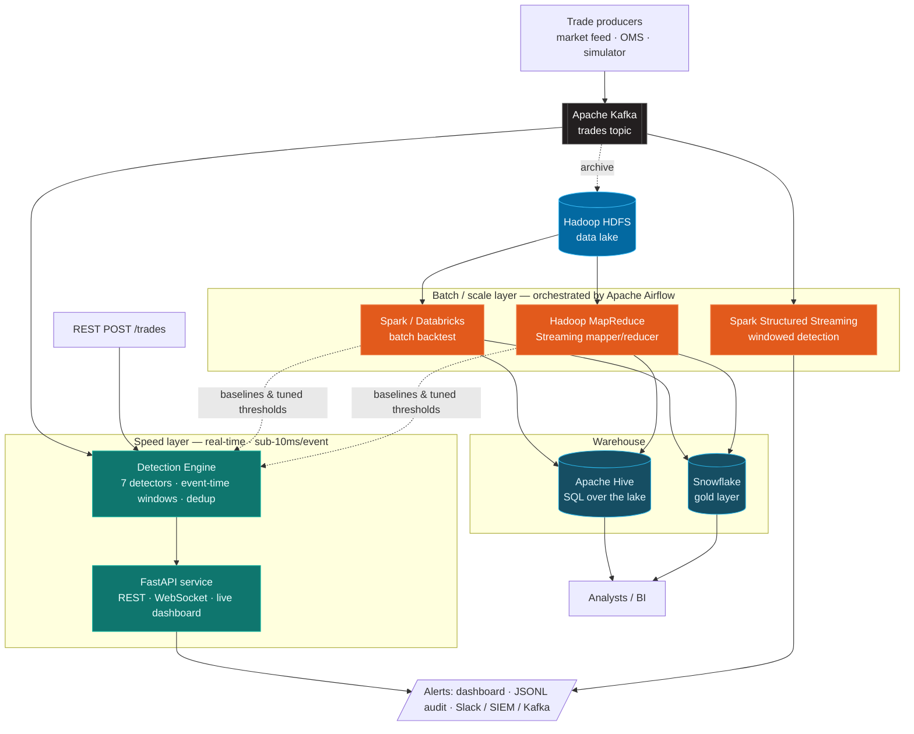

# TradeWatch &nbsp;

A real-time trade-surveillance engine that watches a live market feed and flags
manipulation and bad prints — spoofing, wash trades, volume spikes, fat-fingers —
the instant they happen, with a plain-English reason attached to every alert.

<p>
  
  
  
  
  
  
  
  
</p>

📄 Docs: [Requirements (SRS)](docs/SRS.md) · [Design (SDS)](docs/SDS.md) · [Architecture](docs/ARCHITECTURE.md) · [Data platform](docs/DATA_PLATFORM.md) · [Security](docs/SECURITY.md) · [Deployment](docs/DEPLOYMENT.md)

---

## Why this exists

Exchanges, brokers, prop desks and crypto venues are legally required to surveil
their own order flow for **market abuse** — spoofing, layering, wash trading,
momentum ignition — and to catch **fat-finger / bad-data** prints before they
cause losses. The off-the-shelf tools that do this are expensive, opaque black
boxes.

I wanted to see whether the core of one could be built as something small,
transparent and fast: a streaming engine that decides every trade in
milliseconds, explains *why* it flagged each one, and comes with the same
detection logic wired into a real big-data stack (Kafka, Spark, Hadoop, a
warehouse) so it scales past a single machine. TradeWatch is that engine.

> On a labelled 15k-trade benchmark it catches **96%+ of injected manipulation
> episodes at a <1% false-alarm rate**, deciding each trade with a **p99 latency
> of ~0.3 ms** (rule core). Both numbers are enforced as CI gates.

---

## How It Works

TradeWatch is a **Lambda-style** system: a low-latency **speed layer** for
real-time alerting, and a distributed **batch/scale layer** that runs the *same*
detection logic over data at rest. Because both layers share one trade schema and
one set of rules, offline and online never disagree.

**The path of a single trade (speed layer):**

1. A trade arrives — from **Apache Kafka**, a `POST /trades` REST call, or the
   built-in market simulator.
2. The engine updates that symbol's rolling **event-time window** (keyed on the
   trade's own timestamp, not wall-clock — so it stays correct under replay and
   back-pressure).
3. **Seven detectors** score the trade against that window: price z-score, price
   spike, volume spike, trade velocity, spoofing/imbalance, wash/self-trade, and
   an online **Isolation Forest** for multivariate outliers.
4. A per-`(symbol, detector)` **cooldown** collapses a noisy episode into one
   actionable alert (the same idea as PagerDuty alert grouping) — this is the
   single biggest lever on the precision/noise trade-off.
5. Surviving alerts stream to the dashboard, a JSONL audit trail, and any sink
   you attach (Slack, SIEM, Kafka), each carrying a severity, a normalized score
   and a human-readable reason.

**At scale (batch layer):** the trade tape is archived to a **Hadoop HDFS** data
lake. **Apache Spark / PySpark** re-runs the detectors as Spark SQL window
functions for backtesting and threshold tuning, and a **Hadoop MapReduce** job
does massive batch anomaly scans. Results land in an **Apache Hive** + **Snowflake**
warehouse for analysts, and the learned baselines can seed the live engine. An
**Apache Airflow** DAG orchestrates the whole nightly ETL with retries and a
data-quality gate.

**How good is it?** `tradewatch evaluate` streams labelled data (normal flow +
injected abuse episodes) through the engine and scores it with **event-based**
metrics — the standard for surveillance: *did we catch the episode, and how noisy
were we on normal flow?*

```
  trades evaluated     : 15,000
  anomaly events       : 258
  events detected      : 248        precision : 0.674
  false-alarm episodes : 120        recall    : 0.961   F1 : 0.792
  false-positive rate  : 0.997%     (of normal trades)
    price_spike 100.0% · spoofing 92.3% · velocity 95.1% · volume 97.6% · wash 94.9%
```

---

## Features

- **Real-time anomaly alerts** — scores every trade against 7 statistical,
  behavioural and ML detectors and emits explainable alerts in **sub-10 ms**.
- **Catches real market abuse** — spoofing, wash trades, volume/price spikes,
  quote stuffing and fat-fingers, each measured against a labelled benchmark
  (96%+ recall, <1% false-alarm rate) as a CI gate.
- **Big-data scale layer** — the identical rules run distributed over **Kafka +
  Spark + Hadoop (HDFS/MapReduce)**, landing in a **Hive + Snowflake** warehouse,
  all orchestrated by **Airflow**.
- **Multi-page analytics console** — a 9-page real-time dashboard (overview, live
  feed, per-instrument drill-down, detectors, latency, platform health) with
  custom canvas charts and zero external JS, served by the app itself.
- **Hardened & audited** — API-key auth, rate limiting, input guardrails,
  security headers/CSP, and an append-only audit trail on the write path.
- **Integrate anywhere** — REST, WebSocket stream, an embeddable Python API, or a
  Kafka consumer; ships with Docker, compose stacks and a production TLS overlay.

---

## Tech Stack

| Layer | Choice | Why |
|---|---|---|
| Real-time engine | **Python 3.10+**, **scikit-learn** | Synchronous, allocation-light hot path; Isolation Forest for multivariate outliers |
| Ingestion | **Apache Kafka** (`aiokafka`) | Decouples producers from detection; replayable production trade tape |
| Service / API | **FastAPI**, **Uvicorn**, WebSocket | Async REST decisioning + live streams; self-hosted dashboard |
| Distributed compute | **Apache Spark / PySpark**, **Databricks** | Same detectors as Spark SQL over the lake — backtest + Structured Streaming at scale |
| Data lake + batch | **Apache Hadoop** (HDFS + MapReduce) | Durable at-rest storage and massive batch anomaly scans |
| Warehouse | **Apache Hive**, **Snowflake** | SQL over the lake + a cloud gold layer for BI |
| Orchestration | **Apache Airflow** | Nightly ETL with retries and a data-quality gate |
| Config / validation | **Pydantic v2**, YAML | Typed models, 12-factor settings, tunable rules without code changes |
| Delivery | **Docker**, **docker-compose**, **GitHub Actions** | Reproducible stacks + CI quality gates (tests, precision/recall, latency) |

Only the non-obvious choices are justified above — the rest are standard for the
job they do.

---

## Architecture

A **Lambda-style** split: a real-time speed layer for alerting, and a Spark/Hadoop
scale layer for heavy historical and distributed processing. Both apply the same
rules over the same schema.


```mermaid
flowchart TB
    PROD[Trade producers<br/>market feed · OMS · simulator] --> KAFKA[[Apache Kafka<br/>trades topic]]

    subgraph SPEED[Speed layer — real-time · sub-10ms/event]
        direction TB
        ENG[Detection Engine<br/>7 detectors · event-time windows · dedup]
        API[FastAPI service<br/>REST · WebSocket · live dashboard]
        ENG --> API
    end

    HDFS[(Hadoop HDFS<br/>data lake)]

    subgraph SCALE[Batch / scale layer — orchestrated by Apache Airflow]
        direction TB
        SS[Spark Structured Streaming<br/>windowed detection]
        BB[Spark / Databricks<br/>batch backtest]
        MR[Hadoop MapReduce<br/>Streaming mapper/reducer]
    end

    subgraph WH[Warehouse]
        direction TB
        HV[(Apache Hive<br/>SQL over the lake)]
        SF[(Snowflake<br/>gold layer)]
    end

    KAFKA --> ENG
    REST[REST POST /trades] --> ENG
    KAFKA --> SS
    KAFKA -. archive .-> HDFS
    HDFS --> BB
    HDFS --> MR
    BB & MR --> HV & SF
    BB & MR -. baselines & tuned thresholds .-> ENG

    API --> OUT[/Alerts: dashboard · JSONL audit · Slack / SIEM / Kafka/]
    SS --> OUT
    HV & SF --> BI[Analysts / BI]

    classDef k fill:#231F20,stroke:#555,color:#fff;
    classDef speed fill:#0f766e,stroke:#14b8a6,color:#ecfeff;
    classDef scale fill:#E25A1C,stroke:#f59e6b,color:#fff;
    classDef lake fill:#0369a1,stroke:#38bdf8,color:#f0f9ff;
    classDef wh fill:#164e63,stroke:#29B5E8,color:#e0f7ff;
    class KAFKA k;
    class ENG,API speed;
    class SS,BB,MR scale;
    class HDFS lake;
    class HV,SF wh;
```

**The one design decision worth calling out:** the engine core is **synchronous
and transport-agnostic** — a `TradeSource` produces trades, the `DetectionEngine`
turns each into zero-or-more `Alert`s, an `AlertSink` delivers them. Concurrency
lives only at the edges (the async pipeline and I/O sinks). The trade-off: the hot
path can't `await`, so a slow detector blocks the loop — but in exchange the core
is predictable, cheap, trivially unit-testable, and embeddable in any Python
process. For a CPU-bound decision that must be measured in microseconds, that's
the right call. Full write-up in **[docs/ARCHITECTURE.md](docs/ARCHITECTURE.md)**.

---

## Getting Started

**Requirements:** Python 3.10+ (everything below runs without Docker); Docker +
~4–6 GB RAM only if you want the full live big-data stack.

```bash
git clone https://github.com/PerinbaBuilds/TradeWatch.git
cd TradeWatch
cp .env.example .env          # all values have sane defaults; edit if you like
pip install -e ".[dev]"
tradewatch serve              # → http://localhost:8000
```

That's the whole thing running with the built-in market simulator feeding the
engine and dashboard — under five minutes from clone to a live console.

**Run the full big-data platform** (Kafka + HDFS + Spark + Hive + Airflow + API,
all live and wired together — needs Docker with ~12 GB RAM):

```bash
docker compose -f docker-compose.full.yml up --build     # or: make stack
```

| Service | URL |
|---|---|
| **Dashboard** | http://localhost:8000 |
| Spark master | http://localhost:8080 |
| HDFS NameNode | http://localhost:9870 |
| Airflow | http://localhost:8081 (`admin`/`admin`) |

A lighter live subset is `docker-compose.core.yml` (~4–6 GB, `make core`) — the
quickest way to watch the dashboard's **Platform** page go all-green.

**Deploy to production** — behind TLS, with auth, rate limits and an audit trail:

```bash
cp .env.docker.example .env   # set TRADEWATCH_API_KEY + DOMAIN
make prod                     # core stack + Caddy HTTPS overlay
```

Full production runbook (scaling, HA, security checklist) in
**[docs/DEPLOYMENT.md](docs/DEPLOYMENT.md)**.

---

## Usage

**Real-time decisioning over REST** — `POST /trades` returns the decision synchronously:

```bash
curl -s localhost:8000/trades -H 'content-type: application/json' -d '{
  "symbol": "AAPL", "price": 999.0, "quantity": 100, "side": "buy"
}' | jq
```

```json
{
  "trade_id": "trd_9f2c...",
  "anomalous": true,
  "alerts": [
    { "detector": "zscore", "severity": "critical", "score": 1.0,
      "reason": "price 999.0000 is +42.10σ from mean 194.9812 (σ=0.19)" }
  ]
}
```

**Live alert stream over WebSocket:**

```
ws://localhost:8000/ws/alerts     # every alert as it fires
ws://localhost:8000/ws/trades     # the raw trade tape
```

**Embed the engine** — no server needed:

```python
from tradewatch import DetectionEngine, Trade

engine = DetectionEngine()
for alert in engine.process(Trade(symbol="BTC-USD", price=61990, quantity=0.5)):
    print(alert.severity, alert.reason)
```

**Prove it works** with hard numbers, or stream to your terminal:

```bash
tradewatch evaluate --trades 15000   # precision / recall / F1 vs. labelled data
tradewatch bench                     # per-event latency (p50/p95/p99)
tradewatch simulate --tps 30         # stream alerts to the console
```

**Key HTTP endpoints:** `GET /` (console) · `GET /health` · `GET /stats` ·
`GET /api/metrics?window=N` · `GET /api/platform` (per-component health) ·
`GET /alerts?limit=N` · `POST /trades`.

**Tune detection** without touching code — thresholds live in
[`config/detection_rules.yaml`](config/detection_rules.yaml); service settings are
`TRADEWATCH_*` env vars documented in [`.env.example`](.env.example).

---

## Known Limitations / What I'd Do Differently

Being honest about where this stands:

- **Trade-level, not order-book.** The spoofing/layering detectors work on the
  *trade* tape, not L2 order-book events, so they infer intent from imbalance
  rather than cancel-to-fill ratios. Real spoofing surveillance wants the book —
  I'd add an L2 feed and cancel-ratio detectors next.
- **The Isolation Forest dominates latency.** It adds ~9 ms/event (vs ~0.3 ms for
  the rule core) from per-event tree traversal and periodic refits. For max
  throughput it belongs in the Spark scale layer, not the hot path — the ruleset
  lets you disable it online.
- **In-memory alert state.** Dedup/cooldown state lives in the process, so it
  resets on restart and doesn't share across replicas. For real HA I'd back it
  with Redis/ClickHouse and partition consumers by symbol (noted in the deploy
  guide).
- **Snowflake & Databricks are managed SaaS** — they can't run in the local
  compose stack. The bundled Spark cluster is the runnable stand-in; the
  Snowflake/Databricks paths activate when you supply credentials.
- **Simulator-driven benchmark.** The precision/recall numbers come from a
  labelled *simulator*, which is honest for measuring the detectors but isn't real
  market microstructure. Validate against your own tape before trusting a number.

---

## License

[MIT](LICENSE) © PerinbaBuilds
