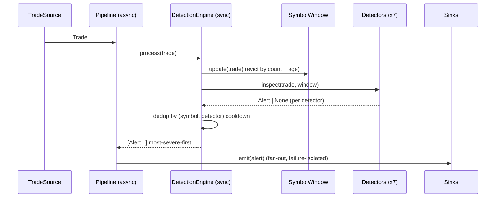

# Architecture

This document is the detailed technical reference for how TradeWatch is built —
its layers, the contracts between them, the data flow, the design decisions and
their trade-offs, and how it scales and fails. For the high-level pitch see the
[README](../README.md); for requirements and formal design see
[SRS](SRS.md) / [SDS](SDS.md).

---

## 1. Design goals

TradeWatch was built to satisfy five constraints at once:

1. **Low, predictable per-trade latency** — a decision in single-digit
   milliseconds, with a p99 that doesn't drift under load.
2. **Explainability** — every alert carries the numbers that triggered it, so a
   human analyst can accept or dismiss it without reading code.
3. **Correctness under replay and back-pressure** — the same input tape must
   produce the same alerts whether it arrives live, delayed, or re-played from an
   archive.
4. **One detection logic, two execution modes** — the rules that run in real time
   must also run distributed over data at rest, without a second implementation
   drifting out of sync.
5. **Embeddable and swappable** — the core must drop into any Python process, and
   every edge (source, sink, transport) must be replaceable without touching the
   core.

Everything below is downstream of these five goals.

---

## 2. The three-layer contract

At the heart of the system is a strict, three-part contract. Any part can be
swapped without touching the others:

```
TradeSource  ──▶  DetectionEngine  ──▶  AlertSink
 (produce)         (decide)             (deliver)
```

| Role | Interface | Responsibility (one line) | Implementations |
|---|---|---|---|
| `TradeSource` | `stream() -> AsyncIterator[Trade]` | Produce trades from somewhere | `MarketSimulator`, `KafkaTradeSource`, REST `POST /trades` |
| `DetectionEngine` | `process(Trade) -> list[Alert]` | Turn one trade into zero-or-more alerts | single implementation (`engine.py`) |
| `AlertSink` | `emit(Alert) -> None` | Deliver an alert somewhere | `ConsoleSink`, `JsonlFileSink`, `Broadcaster` (WebSocket) |

The `Pipeline` (`pipeline.py`) is the async driver that wires a source to the
engine to a set of sinks. Because the three interfaces are tiny, adding a Slack
sink, a SIEM forwarder, a Kafka producer sink, or a database source is a
~30-line file — no change to the engine.

---

## 3. System-level architecture (Lambda-style)

At the system level TradeWatch is a **Lambda architecture** — a real-time speed
layer beside a batch/scale layer, both applying identical rules over an identical
schema so their outputs agree.

### 3.1 Speed layer (real-time, sub-10 ms/event)

Apache Kafka → the FastAPI-hosted `DetectionEngine`. This is the code under
`src/tradewatch/`. It decides each trade in single-digit milliseconds and streams
alerts to the dashboard and sinks. It holds only bounded, in-memory per-symbol
state (the rolling windows and dedup timers), which is what keeps it fast.

### 3.2 Batch / scale layer

Distributed jobs that apply the same statistical detectors over large, at-rest
data:

- **Apache Spark / PySpark** (`spark/`) — the detectors expressed as Spark SQL
  window functions (`detection_sql.py`). Two entry points: `batch_backtest.py`
  (historical Parquet backtest for threshold tuning) and `streaming_job.py`
  (distributed Structured Streaming over the same Kafka topic). **Databricks** is
  managed Spark — `databricks/` holds the job notebook + spec.
- **Apache Hadoop** (`hadoop/`) — **HDFS** as the durable data lake, and a
  **MapReduce** (Hadoop Streaming) job for massive batch anomaly scans. The
  `mapper.py` emits symbol-keyed records; `reducer.py` does per-symbol z-score /
  volume detection. `mapper | sort | reducer` is exactly what the cluster runs,
  so it is CI-tested through the same Unix pipe with no cluster.

Spark and MapReduce read/write the same `hdfs://` paths. Baselines and tuned
thresholds learned here can seed the live engine.

### 3.3 Warehouse & orchestration

- **Apache Hive** — external tables (`warehouse/hive/schema.hql`) giving SQL over
  the HDFS lake.
- **Snowflake** — a cloud "gold" layer (`warehouse/snowflake/`): DDL + a
  Parquet→Snowflake loader for BI.
- **Apache Airflow** (`airflow/dags/`) — a DAG orchestrating the nightly ETL:
  land → Spark backtest → MapReduce scan → Hive → Snowflake, with retries and a
  data-quality gate between stages.

See [Data platform](DATA_PLATFORM.md) for the full warehouse/ETL detail.

### 3.4 Why the same rules in both layers

All layers read the identical trade schema — `spark/detection_sql.py` and the
Hadoop mapper mirror `tradewatch.models.Trade` — and apply the same thresholds
from the same ruleset. This is the property that makes a backtest meaningful: if
the offline layer says a threshold change would have cut false positives 20%, the
online layer will behave identically when you ship it.

---

## 4. Speed-layer data flow (the hot path in detail)

1. A **`TradeSource`** yields `Trade` objects (`sources/`). The API's
   `POST /trades` is a source too — it hands trades straight to the engine and
   returns the decision synchronously.
2. The **`Pipeline`** (`pipeline.py`) is the async driver: it pulls from the
   source, calls the engine, and fans alerts out to sinks. It is cancellation-safe
   and tolerant of individual sink failures (a slow or throwing sink can't take
   down the pipeline).
3. The **`DetectionEngine`** (`engine.py`) is synchronous and transport-agnostic.
   For each trade it:
   - updates that symbol's rolling **event-time window** (`windows.py`);
   - runs every enabled **detector** (`detectors/`) against the window;
   - applies **dedup/cooldown** so one episode yields one alert;
   - returns alerts sorted most-severe-first.
4. An **`AlertSink`** delivers alerts (`sinks/`): console, JSONL audit file, or
   the in-process `Broadcaster` that powers the WebSocket dashboard.



---

## 5. The detection core

### 5.1 The seven detectors

| Detector | Targets | Core idea |
|---|---|---|
| Z-score (price) | Off-market prints, bad ticks | Price > N σ from the rolling per-symbol mean |
| Price spike | Gaps, momentum ignition, fat fingers | Large instantaneous tick-to-tick % move |
| Volume spike | Block trades, fat-finger sizes | Size ≫ rolling **median** (robust to outliers) |
| Velocity | Quote stuffing, algo runaways | Trade count per symbol in a short window exceeds a cap |
| Spoofing / imbalance | Spoofing, layering | Heavily one-sided burst of prints in seconds |
| Wash / self-trade | Wash trading, painting the tape | Same beneficial owner both sides, matched price & size |
| Isolation Forest | Novel / multivariate anomalies | Online-trained model scores the *joint* feature vector |

Each detector is one file implementing a single `inspect(trade, window)` method,
reads shared per-symbol window state, and is unit-tested in isolation with a
hand-built `SymbolWindow`.

### 5.2 Why event-time windows

Detectors that reason about *rate* (velocity) or *recency* (spoofing, wash
trades) must key off the trade's own timestamp, not the moment it was processed.
Event-time makes detection correct under replay, back-pressure and out-of-order-ish
arrival, and it makes offline evaluation faithful to live behaviour. Each
`SymbolWindow` evicts by **both count and age**, so its statistics track a
bounded, recent slice of the market.

### 5.3 Why a synchronous engine core

The hot path — a window update plus a handful of O(window) detector checks — is
pure CPU and must be predictable and cheap. Keeping it synchronous avoids
per-trade task/coroutine overhead, makes the engine trivially embeddable and
unit-testable, and gives a stable p99. **The trade-off:** the core can't `await`,
so a pathologically slow detector blocks the loop. That is an acceptable price for
a CPU-bound decision measured in microseconds — and concurrency still lives at the
edges (the async pipeline and I/O sinks), where it belongs.

### 5.4 Alert deduplication

A single manipulation episode (say a 50-trade velocity burst) would otherwise
produce dozens of near-identical alerts, and the burst's *aftermath* keeps the
short window "hot" for a few seconds. The engine records the event-time of the
last emitted alert per `(symbol, detector)` and suppresses repeats within
`alert_cooldown_seconds`. This mirrors alert-grouping in incident tools and is
the single biggest lever on the precision/noise trade-off.

---

## 6. Service & API layer

`api/app.py` builds the FastAPI application: REST decisioning (`POST /trades`),
introspection (`/health`, `/stats`, `/config`, `/alerts`), the consolidated
dashboard snapshot (`/api/metrics`), per-component platform health
(`/api/platform`), two WebSocket streams (`/ws/alerts`, `/ws/trades`), and the
self-hosted multi-page console (`dashboard.html`, zero external JS so it is
CSP-safe).

`platform_health.py` runs **real** concurrent async TCP probes against Kafka,
HDFS, Spark, Hive and Airflow, and reads the batch runner's heartbeat file — the
Platform page reflects genuine service state, never a hard-coded status.

---

## 7. Security & observability (cross-cutting)

Security is not a layer; it wraps the write path and every response:

- **Authentication** — optional API-key on `POST /trades` (`api/security.py`).
- **Rate limiting** — per-client token bucket.
- **Input guardrails** — `guardrails.py` validates/bounds trade fields before they
  reach the engine.
- **Hardening headers** — security headers + CSP on every response; CORS allow-list.
- **Audit + logging** — `observability.py` emits structured, request-id-correlated
  JSON logs and an append-only audit trail, making the system SIEM-ready.

See [Security](SECURITY.md) for the threat model and controls.

---

## 8. Deployment topology

Three compose stacks layer up, plus a production overlay:

| Stack | Contents | RAM | Use |
|---|---|---|---|
| `docker-compose.yml` | API + dashboard (optional Kafka/Hadoop profiles) | ~1 GB | Local dev / demo |
| `docker-compose.core.yml` | Kafka + HDFS + Spark + batch + API — all live | ~4–6 GB | See the Platform page go green |
| `docker-compose.full.yml` | Core + Hive + Airflow | ~12 GB | Full big-data platform |
| `docker-compose.prod.yml` (overlay) | Caddy TLS proxy, mandatory API key, resource limits, log rotation | overlay | Production |

The batch layer runs from a baked image (`Dockerfile.batch` — Spark + Java +
package) so it never pip-installs at container start. The production overlay hides
the API port behind Caddy (automatic HTTPS), enforces `TRADEWATCH_API_KEY`, and
applies per-service CPU/memory limits. See [Deployment](DEPLOYMENT.md).

---

## 9. Scaling & failure modes

**Horizontal scale (speed layer).** The engine is **stateful** — its window and
dedup state are per-symbol and in-memory. To scale out you therefore **partition
the Kafka topic by symbol** and run one consumer per partition set, so all trades
for a symbol land on the same engine instance. Round-robin partitioning would
split a symbol's window across instances and corrupt rate/recency detection.

**State durability.** Because dedup/window state is in-process, it resets on
restart and is not shared across replicas. Alerts already emitted are durable (the
audit sink); the *suppression* memory is not. For strict HA this state would move
to Redis/ClickHouse — noted as future work.

**Failure isolation.** The pipeline continues if a single sink throws or blocks;
the engine never depends on a sink succeeding. Kafka consumption resumes from the
committed offset on restart, so no trades are silently dropped.

**Batch layer.** Spark/MapReduce jobs are idempotent over their input paths and
orchestrated with retries by Airflow; a failed nightly run re-runs without
double-counting because it rewrites its output partitions.

---

## 10. Extending it

**Add a detector** — create `detectors/my_detector.py`:

```python
from .base import Detector
from ..models import Alert, Severity

class MyDetector(Detector):
    name = "my_detector"
    def inspect(self, trade, window):
        if suspicious(trade, window):
            return Alert.build(trade=trade, detector=self.name,
                               severity=Severity.HIGH, score=0.8, reason="...")
        return None
```

Register it in `engine.py::_build_detectors` (gated on a config flag) and add a
`MyDetectorConfig` to `config.py`. Unit-test it in isolation with a hand-built
`SymbolWindow`.

**Add a source or sink** — implement `TradeSource.stream()` or `AlertSink.emit()`
and pass it to the `Pipeline`. Nothing in the engine changes.

**Tune detection** — edit `config/detection_rules.yaml`; every value maps to a
field in `tradewatch.config.DetectionConfig`, so thresholds change with no code
edit and the CI quality gate tells you if a change hurt precision/recall.
