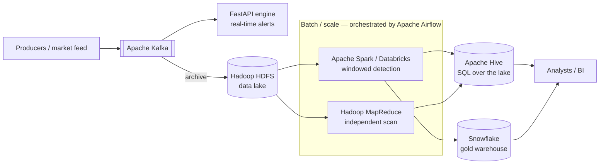

# Data platform & ETL

TradeWatch is a full **big-data lakehouse + warehouse** pipeline, not just a
real-time service. This document explains how each technology fits and how data
flows from ingestion to the gold layer.



## Layers

| Layer | Technology | Purpose |
|---|---|---|
| **Ingestion** | Apache Kafka | Durable, replayable trade tape; decouples producers from consumers |
| **Speed** | FastAPI engine (Python + scikit-learn) | Sub-10ms real-time alerts + the analytics console |
| **Data lake** | Hadoop **HDFS** | Cheap, durable storage of raw + curated data (JSON / Parquet) |
| **Distributed compute** | Apache **Spark** / **Databricks** | Windowed detection & backtesting at scale; Databricks = managed Spark |
| **Batch compute** | Hadoop **MapReduce** | Independent, framework-diverse batch anomaly scan |
| **Lake SQL** | Apache **Hive** | SQL warehouse surface over HDFS (external tables) |
| **Cloud warehouse** | **Snowflake** | Gold layer for BI, ad-hoc analytics, long-term retention |
| **Orchestration / ETL** | Apache **Airflow** | Schedules & wires the daily batch pipeline with retries + quality gates |

## Medallion / lakehouse flow

1. **Bronze (raw)** — Kafka lands the raw JSON tape into `hdfs:///tradewatch/trades`
   (partitioned by date). Hive `trades_raw` exposes it as SQL.
2. **Silver (curated)** — the Spark batch job (`spark/batch_backtest.py`) or the
   Databricks job cleans/normalises trades to Parquet and computes features.
3. **Gold (serving)** — flagged **anomalies** are written to HDFS/Delta, registered
   in Hive, and loaded into **Snowflake** (`warehouse/snowflake/`) for BI.

The **same statistical detectors** run in three engines — the real-time FastAPI
engine, Spark/Databricks, and Hadoop MapReduce — so streaming and batch agree,
and MapReduce provides an independent cross-check.

## Orchestration (Airflow)

[`airflow/dags/tradewatch_etl.py`](../airflow/dags/tradewatch_etl.py) runs daily:

```
spark_batch_backtest ─┬─▶ hadoop_mapreduce_crosscheck ─┐
                      └─▶ register_hive_partitions ─────┴─▶ load_snowflake ─▶ data_quality_check
```

Retries, SLAs and a data-quality gate (fail the run if a partition produced no
`_SUCCESS`) are built in.

## Where each piece lives

```
spark/                 Spark jobs (batch backtest, structured streaming)
hadoop/                HDFS + MapReduce (mapper/reducer, run scripts)
warehouse/hive/        Hive DDL (external tables over HDFS)
warehouse/snowflake/   Snowflake DDL + Parquet→Snowflake loader
databricks/            Databricks job notebook + job spec
airflow/dags/          Airflow DAG orchestrating the pipeline
```

## Running the platform pieces

| Piece | Command |
|---|---|
| HDFS (local) | `docker compose --profile hadoop up` |
| Kafka → FastAPI | `docker compose --profile kafka up` |
| Spark backtest | `python spark/batch_backtest.py --input data/trades.parquet` |
| MapReduce | `hadoop/run_local.sh data/trades.jsonl` |
| Hive schema | `hive -f warehouse/hive/schema.hql` |
| Snowflake load | `python warehouse/snowflake/load_snowflake.py --input … --dt …` |
| Databricks | deploy `databricks/job.json` via the Databricks CLI |
| Airflow | copy `airflow/dags/` into your Airflow instance |

> **Note.** Kafka, Spark/HDFS and the local MapReduce runner are runnable on a
> laptop (and CI smoke-tests Spark + MapReduce). Hive, Snowflake, Databricks and
> Airflow are **deployment integrations** — the code and configs are production-
> shaped and ready to deploy against those managed services.
